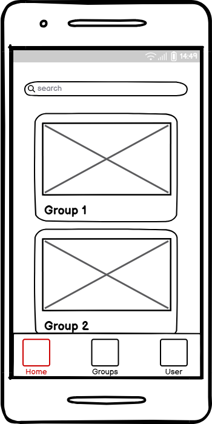
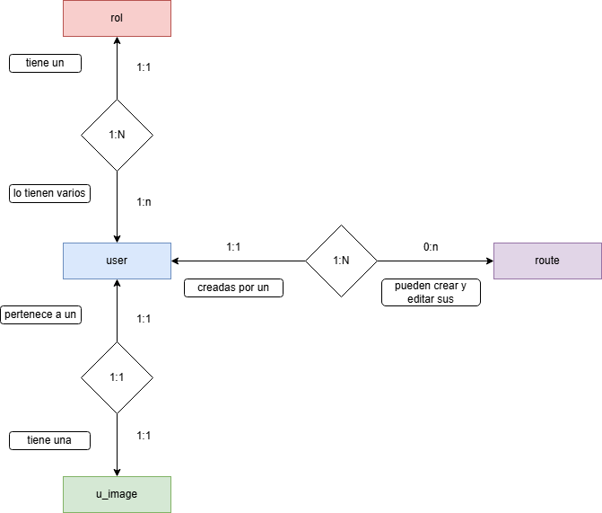

# Routes App

## Índice
- [Descripción de la aplicación](#descripción-de-la-aplicación)
- [Conceptos de wireframe](#conceptos-de-wireframe)

 

___

### Descripción de la aplicación

 Una aplicación online puedan apuntarse personas para hacer rutas senderistas, cualquiera de ellas puede organizar una ruta  ( esteblece el recorrido, la fecha , etc) y que los demás se apuntan se pondrán fotos de las rutas

La app es accesible para cualquier persona en cuanto ver las rutas realizadas ( detalles de texto de la ruta pero nada de fotos personales realizadas durante el trayecto)

El proceso para registrar un nuevo usuario pasa por un formulario específico que puede hacer cualquiera sin estar autenticado. Registra su nombre, apellidos, correo y teléfono, solicitando pertenecer al grupo. Entonces aparecerá un aviso en el home de los usuarios admin informando de solicitud nueva. Los usuarios rol admin son quién llamarían y quedarían con esa persona o lo que corresponda
Una vez un usuario está aceptado por un admin queda registrado ( este proceso lo hacen los admin) y puede acceder a la información ampliada de las rutas: las fotos realizadas si ya se hizo, los participantes apuntados a la próxima ruta, etc

Son los admin los que tienen capacidad para crear una nueva ruta y/o modificarla. Siempre se especifica la fecha (con hora) y el punto de encuentro

___

 

## Conceptos de wireframe

- Versión de escritorio:

    

 

    

 

    

 
 

- Version para móviles:

    

 

    

 

    

 

### Diagramas

    

